# 环境准备

硬件：目前仅支持CloudMatrix384推理卡
操作系统：Linux
Python: >=3.9, <= 3.11

# 环境检查
## Ascend NPU固件和驱动检查
使用如下命令检查Ascend NPU固件和驱动是否正确安装
npu-smi info
正常显示如下图所示

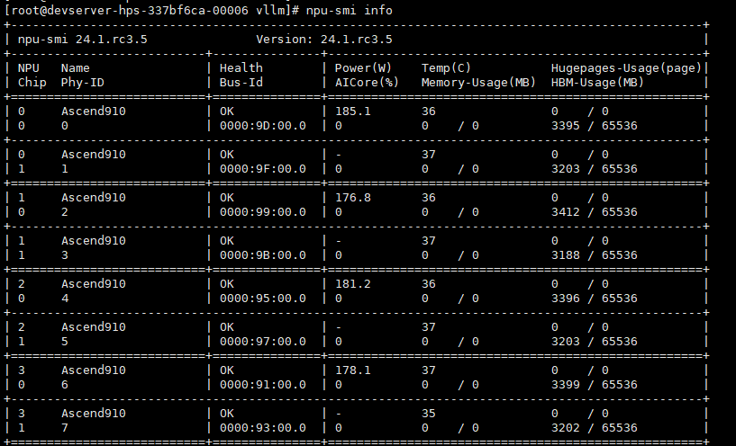

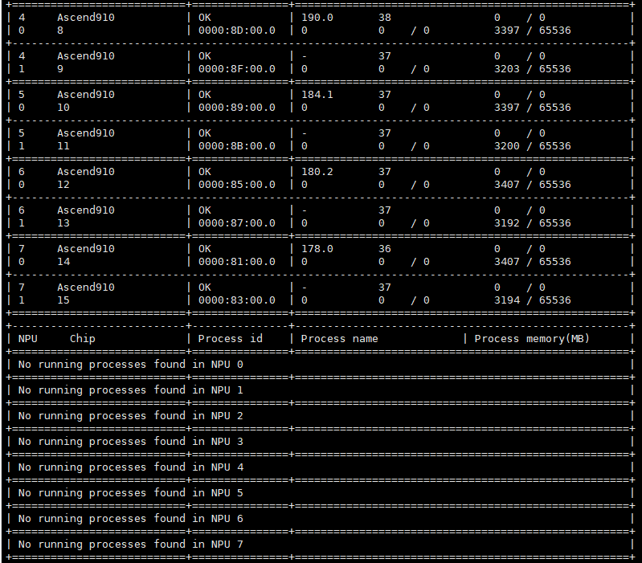

## 网络连通性检查

若要PD分离部署，确保部署PD分离部署的CloudMatrix384机器网络是联通的，可以在其中一台机器上使用ssh命令进行尝试，命令示例

```
ssh root@192.168.1.100
```

# 部署

目前docker镜像中安装好了依赖的CANN和Torch-NPU包，并且已经预装了一个可直接运行的omni-infer和vllm包。配套的CANN和Torch-NPU正式版本正在整理中。

## docker镜像下载

```
docker pull swr.cn-southwest-2.myhuaweicloud.com/omni-ai/omniinfer:202506272026
```

## docker镜像拉起命令

镜像拉起脚本，可以参考如下脚本，第一个参数是镜像image_id，第二个参数是待启动的容器名称

```
IMAGES_ID=$1
NAME=$2
if [ $# -ne 2 ]; then
    echo "error: need one argument describing your container name."
    exit 1
fi
docker run --name ${NAME} -it -d  --shm-size=500g \
    --net=host \
    --privileged=true \
    -u root \
    -w /home \
    --device=/dev/davinci_manager \
    --device=/dev/hisi_hdc \
    --device=/dev/devmm_svm \
    --entrypoint=bash \
    -v /usr/local/Ascend/driver:/usr/local/Ascend/driver \
    -v /usr/local/dcmi:/usr/local/dcmi \
    -v /usr/local/bin/npu-smi:/usr/local/bin/npu-smi \
    -v /etc/ascend_install.info:/etc/ascend_install.info \
    -v /usr/local/sbin:/usr/local/sbin \
    -v /etc/hccn.conf:/etc/hccn.conf \
    -v /usr/bin/hccn_tool:/usr/bin/hccn_tool \
    -v /home/:/home/\
    -v /data:/data \
    -v /tmp:/tmp \
    -v /usr/share/zoneinfo/Asia/Shanghai:/etc/localtime \
    ${IMAGES_ID}

```

## 下载 omni_infer 以及 vllm 源码并安装 vllm
可以选择在宿主机或者容器内下载源码，如果在容器内下载，应在主机挂载在容器的目录下下载；在宿主机内下载则无此约束。
执行如下步骤即可下载 omni_infer 以及 vllm 源码并安装 vllm；如果用户参考 **通过 ansible 部署**章节，执行完前两步即可。
1. git clone 拉取 omni_infer 源码；
2. 在目录 omniinfer/infer_engines 下 git clone 拉取 vllm v0.9.0 源码，注意文件夹名改为 "vllm"；infer_engines下的目录结构如下:
    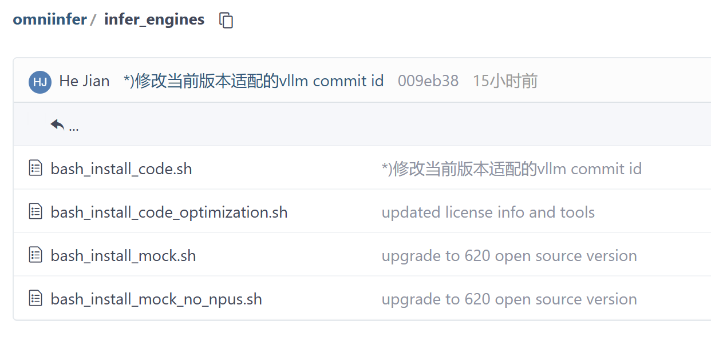

3. 卸载已有的omni_infer包；
    ```bash
    pip uninstall vllm -y
    pip uninstall omni_infer -y
    pip uninstall omni_placement -y (若不存在omni_placement安装包可忽略)
    ```

4. 编译omni_infer，最终在build/dist目录下有生成whl包；
    ```bash
    cd omniinfer
    bash build/build.sh
    ```

5. 进入 build/dist 目录，安装whl包，可以通过pip list查看是否有安装成功；
    ```bash
    cd build/dist

    # 安装 vllm/omni_infer 等 whl 包：
    pip install vllm*.whl
    pip install omni_infer*.whl
    ```

## omni_infer包检查

进入镜像后，使用如下命令检查omni_infer包是否安装

```
pip list | grep omni_infer
```
检查结果如下：


## 混布

目前支持Qwen2.5系列模型TP>=1, DP=1
以Qwen2.5-0.5B-Instruct为例，示例中的--model填充实际的模型存放目录

```
#!/bin/bash
set -e

export GLOO_SOCKET_IFNAME=enp23s0f3
export VLLM_USE_V1=1
export VLLM_WORKER_MULTIPROC_METHOD=fork
export VLLM_ENABLE_MC2=0
export USING_LCCL_COM=0
export VLLM_LOGGING_LEVEL=DEBUG
export ASCEND_RT_VISIBLE_DEVICES=0

python3 -m vllm.entrypoints.openai.api_server \
    --host 0.0.0.0 \
    --port 8300 \
    --model /data/Qwen2.5-0.5B-Instruct \
    --data-parallel-size 1 \
    --tensor-parallel-size 1 \
    --dtype bfloat16 \
    --max-model-len 4096 \
    --trust_remote_code \
    --gpu_memory_utilization 0.9 \
    --enforce-eager \
    --block_size 128 \
    --served-model-name qwen \
    --distributed-executor-backend mp \
    --max-num-batched-tokens 20000 \
    --max-num-seqs 128
```

拉起成功后，可以通过curl命令进行测试

```
curl -X POST http://127.0.0.1:8300/v1/completions -H "Content-Type:application/json" -d '{"model": "qwen","temperature":0,"max_tokens":50,"prompt": "how are you?", "stream":true,"stream_options": {"include_usage": true,"continuous_usage_stats": true}}'
```

## PD分离自动化部署

当前限制说明：
目前仅支持Deepseek-R1-W8A8模型，需要基于开源的Deepseek-R1权重进行转换，参考**权重转换**章节；

目前提供一份转换好的权重供直接下载使用，下载链接（提取码为12345678）：
```
https://e-share.obs-website.cn-north-1.myhuaweicloud.com?v2token=KBL+tPW8sihb1DQcY03GYZZdWrdKg8E2xUI8XrCsr7jo72H22pg6bY8V89ZgmD4Zq4VEcQa802+q2nR4Bydrzm9jjAO1ohYLIIDMeRtttFZR+EpCA2PWmZaVxazPlkJ6qtADFZaESGpEHUxChlLlFQ2xeLp6sXP5qVsj6JEPRh7MA6SmfqK8mLdgi/rmBjY6A0CRJFEe1K5JrgONubynmJaescenf5t0h36szT23dHV46pjw0BCjCFtxJyXqgGWc4T7pv3tugR09oHNLFaVoPi4ZlElNciul9a90kZ6ZOoNJ3ufoRyHA9bTdwqeJGg8jsBFzRr+d+tU1GXd8UaswFHUo805A3MoPlqSRiYThAz+3aPorLkveex99xiEwCq+pajn6S9GzSeY8FLjEMlopGMKfHJ6Z1B5aoGpIBY8UsjG878ixsE/YiZmetkXDO/FPYr/r9sbHqg5pLVXCmaH7uHqVvDabx6Mx0a8GRITN+yjwg08LjS3C76gwCfEqD7FegGitodr7RLSDsuewjGqjgK/7ST2J320CoBBBw5vtAAsDYiDC6LJOEZCN2ht/eAZUHvy7ZrCeBMN1AmagvqsXVJrsn2tof/CL5LpRm7z5eVoFAhLjpyKIOgWjUksthT0MLmqIZCiMoslj9BfCKv780nEeDQZqO/eerh7zT4qojk8Xaxuj9Xvv1fKtJnId608QPtLXDireSzh6aa4tF1b5W747AhNAPzLoNdOzcLheYyw=_Vsd2i2lmljqrcbVJHDC8TZw7tQFHpoZ6ZS0O3b864QM=_DuHhemY++UqCJXeQyjgwdA==
```
目前仅支持支持一个 D 的场景，如支持 4P1D、8P1D 等场景，不支持多个 D，如 4P2D、8P4D 等场景不支持；


### 权重转换

1. 机器准备，准备一台 CloudMatrix384 机器；

2. 下载原始权重，支持的Deepseek-R1原始权重地址：https://www.modelscope.cn/deepseek-ai/DeepSeek-R1.git

3. 安装依赖包，transformers（=4.48.2）和 accelerate，命令如下：
    ```
    pip install transformers==4.48.2
    pip install accelerate
    ```

4. 安装转换工具，转换工具下载地址：https://gitee.com/ascend/msit/tree/8.0.RC1_ZS2.0_20251230
    安装命令如下
    ```
    cd msit-8.0.RC1_ZS2.0_20251230/msmodelslim
    bash install.sh
    ```

5. CANN包安装，参考链接：https://gitee.com/ascend/msit/tree/master/msmodelslim#%E7%8E%AF%E5%A2%83%E5%92%8C%E4%BE%9D%E8%B5%96
     https://www.hiascend.com/developer/download/community/result?module=pt+cann&product=4&model=32

     需要安装**cann-toolkit**和**cann-kernels**，下载链接https://www.hiascend.com/developer/download/community/result?module=pt+cann&product=4&model=32
     安装命令，以aarch64 run包为例
     ```
     chmod +x Ascend-cann-toolkit_8.1.RC1_linux-aarch64.run
     ./Ascend-cann-toolkit_8.1.RC1_linux-aarch64.run --install --quiet
     chmod +x Atlas-A3-cann-kernels_8.1.RC1_linux-aarch64.run
     ./Atlas-A3-cann-kernels_8.1.RC1_linux-aarch64.run --install --quiet
     ```

6. Torch-NPU安装，安装包下载链接：https://www.hiascend.com/developer/download/commercial/result?module=cann

    选择其中的**2.1.0**版本

7. 修改模型权重文件
    modeling_deepseek.py修改，参照下图红框部分，注释掉红框中的代码片段
    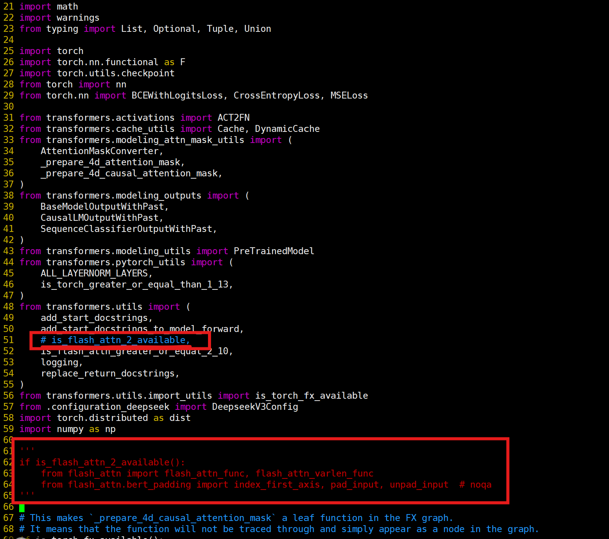

    

    修改代码片段如下

    ```
    from transformers.utils import (
        add_start_docstrings,
        add_start_docstrings_to_model_forward,
        # is_flash_attn_2_available,
        is_flash_attn_greater_or_equal_2_10,
        logging,
        replace_return_docstrings,
    )
    from transformers.utils.import_utils import is_torch_fx_available
    from .configuration_deepseek import DeepseekV3Config
    import torch.distributed as dist
    import numpy as np
    
    '''
    if is_flash_attn_2_available():
        from flash_attn import flash_attn_func, flash_attn_varlen_func
        from flash_attn.bert_padding import index_first_axis, pad_input, unpad_input  # noqa
    '''
    
    ```

    

    

    config.json修改，参照下图红框部分，删除掉红框中的代码片段

    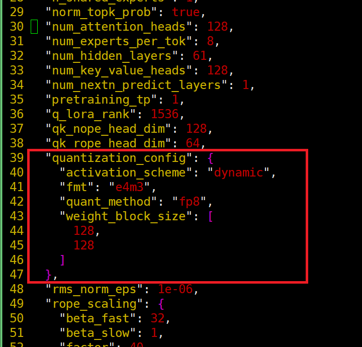

8. 开始转换，执行以下脚本，假设权重和msit都放在/data/models/目录
    ```
    #!/bin/bash
    source /usr/local/Ascend/ascend-toolkit/set_env.sh
    export PYTORCH_NPU_ALLOC_CONF=expandable_segments:False
    export PYTHONPATH=/data/models/msit-8.0.RC1_ZS2.0_20251230/msmodelslim/:$PYTHONPATH
    cd /data/models/msit-8.0.RC1_ZS2.0_20251230/msmodelslim/example/DeepSeek
    python quant_deepseek_w8a8.py --model_path /data/models/DeepSeek-R1 --save_path /data/models/DeepSeek-R1-Quant --from_fp8 --dynamic --disable_anti --quant_mtp --cloud_vllm
    ```
9. 修改转换后的config.json文件中的字段
    将
    ```
    "architectures":"DeepseekV3Fusion",
    ```
    替换为
    ```
    "architectures":["DeepseekV3ForCausalLM"],
    ```
    并将num_hidden_layers从62改为61
### 部署框架介绍

以**4机2P1D**进行示例

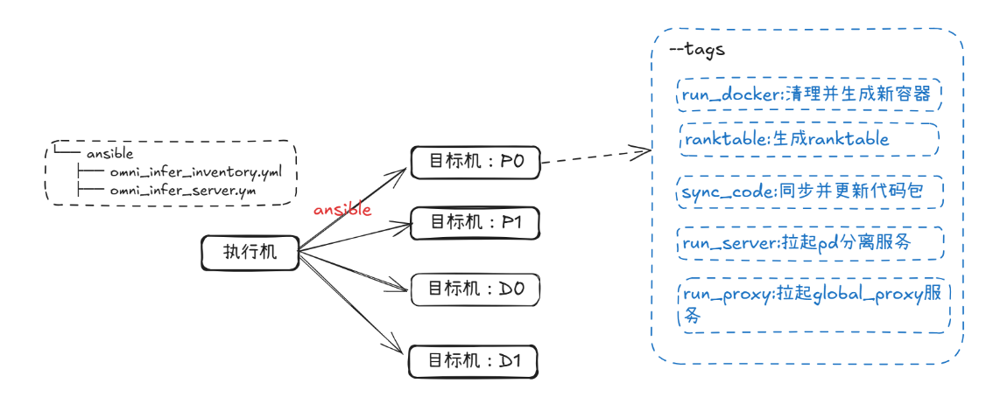

ansible 详细说明参考：**omniinfer**/**tools**/**ansible**/**template**/**README.md**。
在 omniinfer/tools/ansible/ 、 omniinfer/tools/ansible/template/ 和 omniinfer/omni/cli 下面都有 xxx_inventory.yml 和 xxx_server.yml 文件，其中：
1. omniinfer/tools/ansible/ 路径下这两种文件用于 `CI`；
2. omniinfer/tools/ansible/template/ 路径下的这两种文件即可用于 `ansible` 一键部署 `omniinfer` 服务，参考**通过 ansible 部署**章节；
3. omniinfer/omni/cli 路径下的这两种文件即用于 `omni_cli` 一键部署服务，参考 **omni_cli 一键部署**章节。

### 准备密钥文件
首先介绍执行机和目标机的概念，执行机就是运行 `omni_cli` 和 `ansible` 命令的主机，而目标机就是被 `omni_cli` 和 `ansible` 管理的远程主机，也就是用户部署服务所用到的机器。在使用一键式部署命令前，用户需要在执行机上准备好密钥文件（公钥文件和私钥文件），将公钥文件部署到目标机上，执行机使用 `ansible` 命令时就可以通过私钥文件去登录目标机。密钥文件的生成和部署可以参考如下步骤，如果你已经有登录目标机的密钥文件，就不需要执行下列步骤：

1. 首先在执行机生成密钥对：
    ```bash
    ssh-keygen -t ed25519 -C "SSH key comment" -f ~/.ssh/my_key # -t 指定密钥类型 (推荐 ed25519)，-f 指定文件名
    ```
2. 密钥文件默认存放位置为：~/.ssh/。设置密钥文件权限：
    ```bash
    chmod 700 ~/.ssh
    chmod 600 ~/.ssh/id_ed25519     # 私钥必须设为 600
    chmod 644 ~/.ssh/id_ed25519.pub
    ```
3. 部署公钥到远程目标机：
    ```bash
    # 当前只能通过目标机的登录密码去传输公钥文件到远程目标机
    ssh-copy-id -i ~/.ssh/id_ed25519.pub user@remote-host
    ```

### omni_cli 一键部署

该工具目前支持拉起**MTP+入图+omni_placement**的服务配置，若需要修改配置请参考**通过 ansible 部署**章节；
提供的docker镜像中默认安装 omni_cli 工具，在宿主机 **下载omni_infer以及vllm源码并安装vllm** 时 omni_cli 也安装好了，通过以下命令查看是否安装：

```
omni_cli --help
```
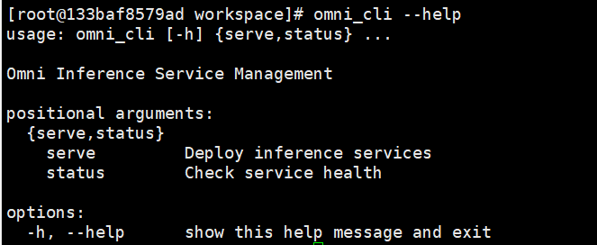

#### 配置文件说明

进入 omni_infer 代码路径下，`cd omniinfer/omni/cli` 进入配置文件所在目录，有 `omni_infer_deployment.yml` 和 `omni_infer_server.yml` 两个配置文件，前者的 `services` 字段下配置参数最终会替换后者中相同的配置，用户只需要修改 `omni_infer_deployment.yml` 中的参数即可，`omni_infer_server.yml` 内的参数修改不涉及（参数修改参考**通过 ansible 部署**章节），
`omni_infer_deployment.yml` 是一个 4P1D 的模板，如果需要增加 P，在 `prefill` 中增加一个 `group5` ，其他配置参考其他 group 配置即可，需要继续增加 P，以此类推；`group` 中的各个字段说明如下：

| 字段                            | 含义                                                                                                                               |
| :-------------------------------- | :----------------------------------------------------------------------------------------------------------------------------------- |
| `user`                      | 远程目标机的用户名， 如 user 等                                                                                                    |
| `hosts`                     | 组成 P/D 所有机器的IP地址，其中 master 节点的 IP地址需要放在首位                                                                                                                     |
| `master_port`               | 即 Prefill 和 Decode 的实际 `master-port`                                                                                      |
| `base_api_port`             | API Server 的端口号                                                                                                                |
| `private_key`               | 连接目标机的私钥文件路径。也可以使用密码登录目标机的方式， 则使用 `password` 字段并将密码填入， 如：password: "passwod"        |
| `ascend_rt_visible_devices` | 每个 Prefill 或 Decode 实例需要使用的卡号， 参数值需要严格按照以下格式: "x,x,x,x" (用英文逗号分隔的连续值) ， 不能有多余逗号和空格 |

如果需要增加 D 的从机器，在 `decode` 的 `group1` 中的 `hosts` 增加对应的机器 ip 即可。

`services` 中的各个字段说明如下：

| 字段                         | 含义                                                                                         |
| :----------------------------- | :--------------------------------------------------------------------------------------------- |
| `local_code_path`    | 执行机上的代码路径，即用户通过 git clone 拉取的代码存放路径。例如用户在 `/workspace/local_code_path` 下 git clone 了代码，那路径就是 `/workspace/local_code_path` |
| `model_path`         | 加载的模型路径，要求 Prefill 和 Decode 所有实例所在的节点提前拷贝好模型并且模型路径保持一致 |
| `code_path`          | 执行机上的 omniinfer 源码路径，即用户通过 `git clone` 拉取的代码存放路径；例如你在 `/workspace/local_code_path` 下 git clone 了代码，那路径就是 `/workspace/local_code_path`；脚本会将执行机上的源码同步到目标机内相同路径下，并且将路径挂载到容器中 |
| `docker_image`       | omniai 服务实例均在容器里面运行，用来指定运行的容器镜像，如: `swr.cn-southwest-2.myhuaweicloud.com/omni-ai/omniinfer:202506272026`，其中 `swr.cn-southwest-2.myhuaweicloud.com/omni-ai/omniinfer` 表示镜像仓地址，`202506272026` 表示镜像版本号，如果远程目标机没有此容器镜像，脚本会自动下载 |
| `prefill: max_model_len` | Prefill 侧模型的最大生成长度， 包含 prompt 长度和 generated 长度， 默认值为32000             |
| `decode: max_model_len`  | Decode 侧模型的最大生成长度， 包含 prompt 长度和 generated 长度， 默认值为16384              |

注意到 P/D 中所有机器的配置都是统一的，但是多数情况下机器的配置是各异的，比如登录目标机的私钥文件路径可能就不一样，所以，如果需要修改 P/D 的某一台机器的配置，可以参照如下，**注意缩进**即可：

```
group1:
  user: "root"
  hosts: "127.0.0.5,127.0.0.6,127.0.0.7,127.0.0.8" # The first IP address of hosts must be the IP address of the master decode instance. 
  master_port: "8080"
  base_api_port: "9000"
  private_key: "/workspace/pem/keypair.pem"
  ascend_rt_visible_devices: "0,1,2,3,4,5,6,7,8,9,10,11,12,13,14,15"
  
  # 修改 IP 为 127.0.0.6 的机器的配置
  host 127.0.0.6:
    private_key: "/workspace/new_pem/keypair.pem"
    base_api_port: "9100"

```

#### 命令执行

```
# 进入到工作目录下
cd /work_path

# 拉起 服务
omni_cli serve /download_path/omni_infer/omni/cli/omni_infer_deployment.yml

# 查看服务是否拉起成功
omni_cli status

# 进入远程目标机日志目录下查看日志
cd /data/omniinfer/log
```

### 通过 ansible 部署（高阶）

#### 环境准备

如果是在执行机的宿主机，需要安装 `ansible` 和 `openssh`:

```
yum install ansible
yum install openssh-server
```

#### 配置文件说明

在 **omniinfer/tools/ansible/template/** 中，有 omni_infer_inventory_used_for_2P1D.yml 和 omni_infer_inventory_used_for_4P1D.yml 两个文件，omni_infer_inventory_used_for_2P1D.yml 用于四机 2P1D 场景，omni_infer_inventory_used_for_4P1D.yml 用于八机 4P1D 场景，其他场景可以参考这两个文件创建新的 inventory 文件；此外还有一个 omni_infer_server_template.yml 文件，这三个
文件的参数配置说明可以参考 **[omniinfer/tools/ansible/template/README.md](https://gitee.com/omniai/omniinfer/blob/master/tools/ansible/template/README.md)**, 以2P1D为例，则修改 omni_infer_inventory_used_for_2P1D.yml 文件，将 `p0/p1/d0/d1/c0` 下面的 `ansible_host:` 值改为机器的 ip，其中p0/p1表示用来部署P的2台A3机器，d0/d1表示用来部署D的2台A3机器，c0表示用来部署globalproxy的机器信息，可以使用p0/p1/d0/d1中的任意一台;

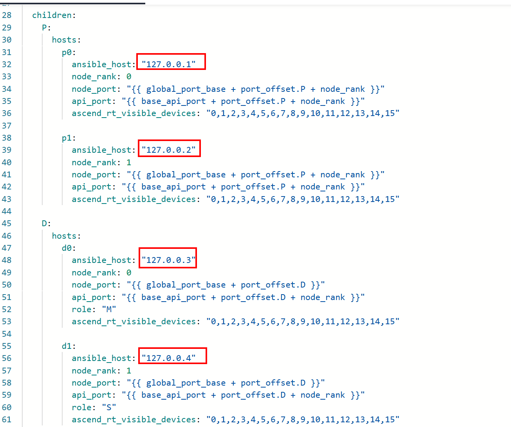

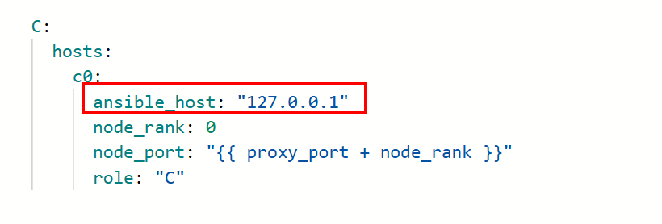


#### 执行命令

```
# 进入到文件目录下执行
cd omniinfer/tools/ansible/template
ansible-playbook -i omni_infer_inventory_used_for_2P1D.yml omni_infer_server_template.yml
```

#### PD分离部署

相关配置：

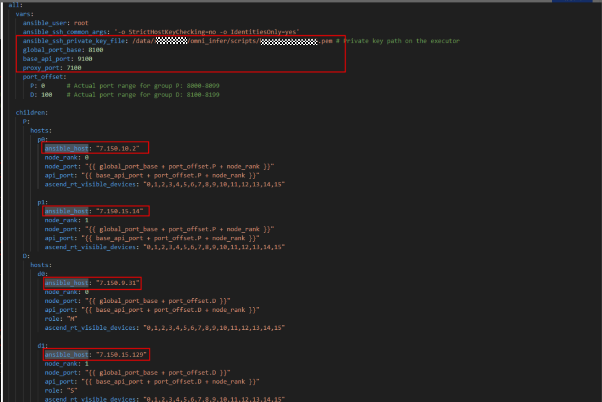

#### global\_proxy部署

相关配置：

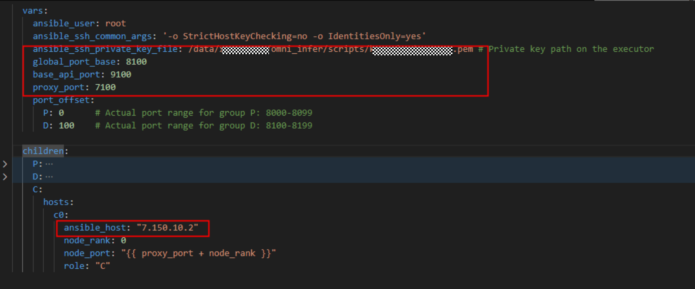

#### 代码同步更新

执行机代码存放路径：/data/omniinfer (可以修改成自己的代码路径，下图synchronize操作就是把执行机的代码同步到目标机上)

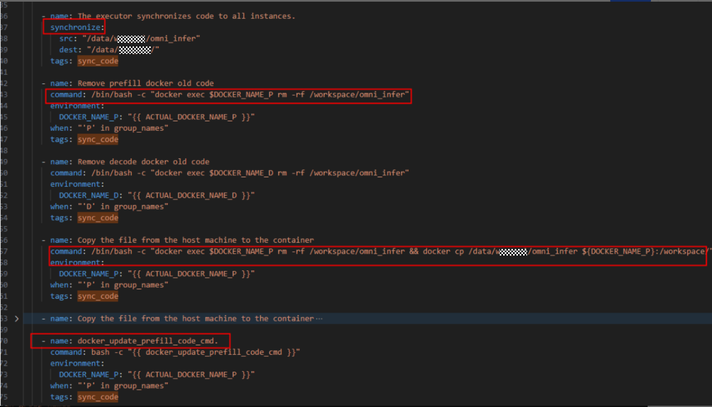

#### Task任务

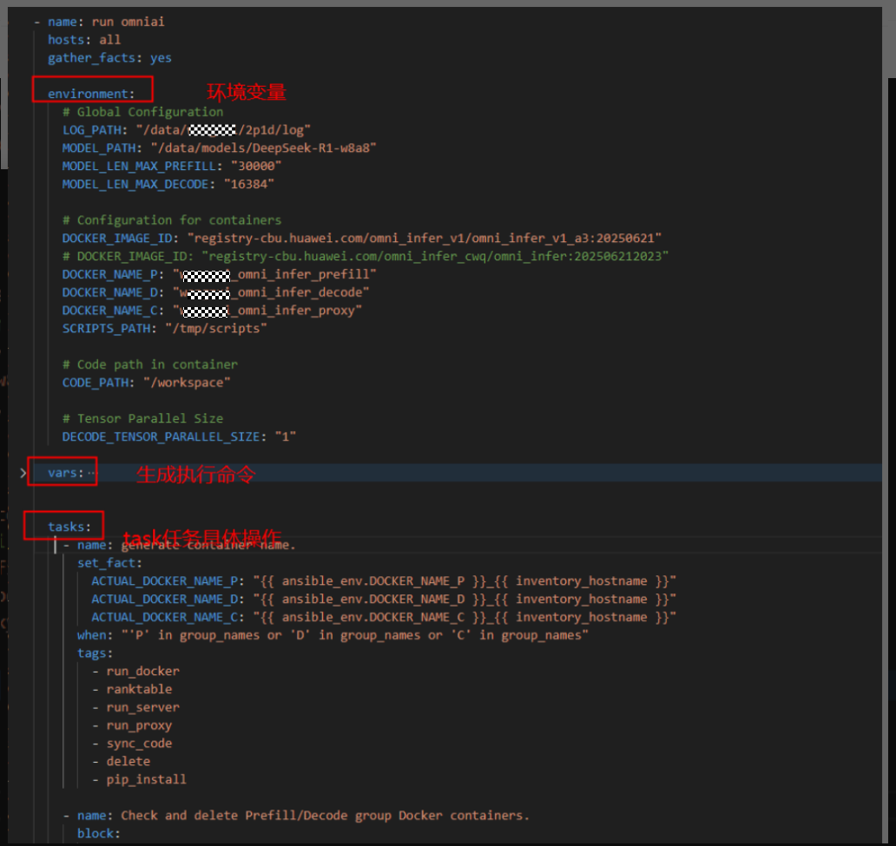

**omni\_infer\_server.yml** 主要放的是自动化的一些操作任务。

通过给 `task` 增加 `tags` 控制管理任务，当前已有的 `tags`:

```
    - run_docker
    - ranktable
    - run_server
    - run_proxy
    - sync_code
```

配置完相关配置信息后拉起服务：

**第一次拉起环境，执行命令：ansible-playbook -i omni\_infer\_inventory.yml omni\_infer\_server.yml**

其他相关操作：

```

ansible-playbook -i omni_infer_inventory_used_for_2P1D.yml omni_infer_server_template.yml --》默认按照task全部任务顺序执行
ansible-playbook -i omni_infer_inventory_used_for_2P1D.yml omni_infer_server_template.yml --tags run_docker --》指定镜像创建并启动新的容器实例
ansible-playbook -i omni_infer_inventory_used_for_2P1D.yml omni_infer_server_template.yml --tags sync_code --》只执行代码同步更新任务
ansible-playbook -i omni_infer_inventory_used_for_2P1D.yml omni_infer_server_template.yml --tags pip_install --》安装 omniinfer 相关包
ansible-playbook -i omni_infer_inventory_used_for_2P1D.yml omni_infer_server_template.yml --tags ranktable --》生成ranktable文件
ansible-playbook -i omni_infer_inventory_used_for_2P1D.yml omni_infer_server_template.yml --tags stop_server --》停止vllm以及nginx服务
ansible-playbook -i omni_infer_inventory_used_for_2P1D.yml omni_infer_server_template.yml --tags run_server --》只执行pd分离服务拉起
ansible-playbook -i omni_infer_inventory_used_for_2P1D.yml omni_infer_server_template.yml --tags run_proxy --》只执行global_proxy分离服务拉起
ansible-playbook -i omni_infer_inventory_used_for_2P1D.yml omni_infer_server_template.yml --tags fetch_log --》将日志存放在执行机指定路径
ansible-playbook -i omni_infer_inventory_used_for_2P1D.yml omni_infer_server_template.yml --skip-tags sync_code --》过滤sync

```

# profiling采集
profiling采集代码位于omni\adaptors\vllm\worker\npu_worker.py文件。
既可以采集prefill，又可以采集decode的profiling。
主要配置项为以下三个环境变量：
1、VLLM_TORCH_PROFILER_DIR，表示profiling文件存放位置，若设置了表示开启采集profiling，没设置则不采集。
2、PROFILER_TOKEN_THRESHOLD，表示step调度的token数，是采集profiling的入口条件，可以根据这个值区分采集的阶段，默认值为1。
3、PROFILER_STOP_STEP，表示采集profiling的步数，需要采集多少就设置为多少，默认为5。
用法：
```
export VLLM_TORCH_PROFILER_DIR=./profiling
export PROFILER_TOKEN_THRESHOLD=1
export PROFILER_STOP_STEP=5
```