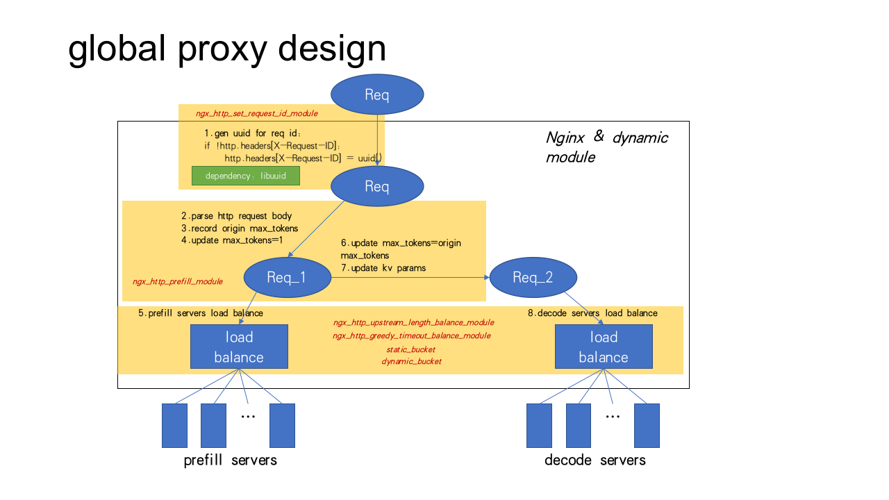

<h1 align="center">
Global Proxy
</h1>

## Global Proxy is A Nginx Enforced Proxy for P/D Disaggregation LLM Inference 

This guide describes how to build and configure Nginx-based Global Proxy dynamic modules.



### PD Disaggregation Support
- **`ngx_http_prefill_module`**: implements prefill decode disaggregation logic. It first generates a subrequest to a internal uri `/prefill_internal` for prefill. After subrequest is done, the main request resumes to go to upstream servers for decode.
- **`ngx_http_set_request_id_module`**: inserts a `X-Request-Id` header if not exist.

### Load Balancing  
#### Development Modules  

We offer several custom NGINX load balancing modules as development templates to help developers quickly learn and prototype new load balancing modules.

- `ngx_http_upstream_length_balance_module`: enables request distribution based on request length to backend servers.

- `ngx_http_upstream_greedy_timeout_module`: enables dynamic load balancing by assigning each request to the backend server that is expected to become available the earliest.
 

#### Bucket-Based Scheduling Configurations  

In addition to dynamic modules, we offer two bucket-based scheduling strategies:

- `static_bucket`: Uses regular expression matching to route short and long requests to different upstream ports.

- `dynamic_bucket`: Dynamically calculates bucket boundaries based on recent request lengths to group similar-length requests together.


#### Batch-Level Balancing in xPyD Scenarios  

Through verification in **xPyD serving scenarios**, we observed that **batch-level balancing** significantly impacts system efficiency. To address this, we designed two specialized modules targeting the Prefill and Decode stages:

- **`ngx_http_upstream_prefill_score_balance_module`**: Designed for the Prefill stage, this module minimizes **Time-To-First-Token (TTFT)** by scoring each peer based on the increase in estimated response time when adding a new request, and selecting the peer with the minimal score increase.

- **`ngx_http_upstream_weighted_least_active_module`**: Tailored for the Decode stage, this module balances both **active request numbers** and **tokens** (including prompt and decoded tokens) across servers to improve decoding throughput and latency consistency.

**[Update 2025-07-20]** Following the shared-memory design we introduced for prefill_score_balance and weighted_least_active, we extend it to build `ngx_http_upstream_pd_score_balance_module`. A shared-memory zone is mapped into both the P and D worker processes, giving each side instantaneous visibility of the other’s queue length, KV-cache pressure, and in-flight token counts. With this unified state, the global proxy can jointly optimize TTFT (Prefill) and TPOT (Decode) in one scheduling decision instead of optimizing the two stages independently.

---


## 1. How to Quickly Use Our Provided Load Balancing Modules

```bash
# Compile the modules
bash build.sh

# Generate the nginx.conf with load balancing
bash global_proxy.sh \
  --nginx-conf-file /usr/local/nginx/conf/nginx.conf \
  --start-core-index 0 \
  --core-num 4 \
  --listen-port 8080 \
  --prefill-servers-list 127.0.0.1:8001,127.0.0.1:8002 \
  --decode-servers-list 127.0.0.1:9001,127.0.0.1:9002 \
  --prefill-lb-sdk pd_score_balance \
  --decode-lb-sdk pd_score_balance
```

## 2. How to Build Your Custom Load Balancing Module

#### 1. **Download the Source Code**

Download the official NGINX source code and related packages:
```bash
wget https://openresty.org/download/openresty-1.21.4.1.tar.gz

tar -xzf openresty-1.21.4.1.tar.gz
```

**Note:** In this example, we use **OpenResty** as the NGINX source distribution for demonstration purposes, since it includes the official NGINX core along with some commonly used modules and enhancements. Alternatively, you can directly download and build from the official [NGINX source code](http://nginx.org/en/download.html) if preferred.

#### 2.**Build the Modules**
```bash
cd openresty-1.21.4.1

CFLAGS="-O2" ./configure --prefix=/usr/local/openresty --with-luajit --add-dynamic-module=/path/to/modules/your_custom_module 

make -j16

make install
```
- `--add-dynamic-module` adds the modules.
- `--with-debug` add to print debug logs.

#### 3. **Start and Test NGINX**

```bash
# Test nginx configuration (in the build directory)
/usr/local/openresty/bin/openresty -t

# Start nginx with the custom config
/usr/local/openresty/bin/openresty -c $/path/to/nginx.conf
```

#### 4. **Stop NGINX**

```bash
/usr/local/openresty/bin/openresty -c $/path/to/nginx.conf -s stop
```


## 3. Configure NGINX
Use the provided sample configuration to enable the module and configure upstream balancing.
#### 1. **Edit the config file**  
   We provide three sample configurations to demonstrate how to use the designed dynamic modules:

* `nginx-pd.conf`: Use prefill_score_balance for P nodes and use length_balance, greedy_timeout, or weighted_least_active for D nodes.
* `nginx-static-bucket.conf`: Apply static_bucket for P nodes, and choose length_balance, greedy_timeout, or weighted_least_active for D nodes.
* `nginx-dynamic-bucket.conf`: Apply dynamic_bucket for P nodes, and choose length_balance, greedy_timeout, or weighted_least_active  for D nodes.

#### 2. **Commom configuration explaination**
* `worker_processes`: Number of worker processes. Each worker process occupies one CPU core.
* `worker_rlimit_nofile`: Maximum number of open files per worker process.

#### 3. **Configuration for length_balance module**
 
* `length_balance_merge_threshold`: Number of requests after which local request statistics are merged into shared memory.
* `length_balance_req_len_weight`: Weight factor for request length when calculating peer score.
* `length_balance_decay_factor`: Exponential decay factor applied to historical request statistics in shared memory.


#### 4. **Configuration for greedy_timeout module** : 

* `greedy_timeout_warmup`: Fixed base time added to each request’s cost before scheduling.
* `greedy_timeout_exp`: Exponent factor ($\alpha$) used in cost calculation: $cost = warmup + length^{\alpha}$.

#### 5. **Configuration for static_bucket module**
Set below regular expression matching to separate short and long requests:
```
    # ---- Static Bucket ----
    # http_content_length ≤ 12_000 byte => bucket_1
    # http_content_length > 12_000 byte => bucket_2
    map $http_content_length $upstream {
        default                                     prefill_bucket1_servers;
        "~^(?:1[2-9][0-9]{3}|[2-9][0-9]{4,})$"      prefill_bucket2_servers;
    }
```

#### 6. **Configuration for dynamic_bucket module**

* `alpha`: Exponential smoothing factor for recent total request lengths, which controls how quickly the system adapts to workload changes. alpha $\in (0, 1)$.
* `bucket_count`: Number of dynamic buckets to divide requests into based on their cumulative lengths.