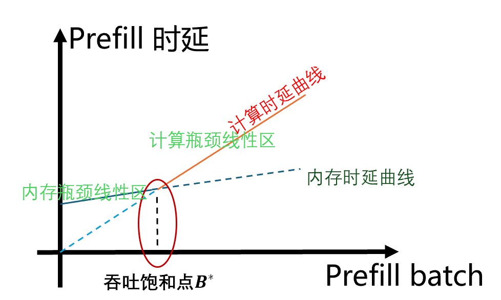

### TFAS：基于队列信息感知的动态最优组batch策略的优化调度算法

vLLM原生调度器采用以内存最大化为中心的策略，优化利用NPU内存资源，通过最大化批处理量（batch size）来提升系统吞吐量。这种策略可以实现内存的高效利用，但是原生调度策略主要关注吞吐量（throughput），未充分考虑首token时延（TTFT），即从请求到达系统到生成第一个token的延迟。

## 特性说明

**系统建模**：我们通过实验发现在不影响吞吐的情况下，存在一个 batch size 甜点区，超过/不足都会导致平均首 token 实验的增加。我们对推理系统进行了数学建模，结合队列信息、系统硬件配置以及模型参数等关键因素，推导出最优 batch size 的计算方法，并集成到调度策略中。在 4P1D, TX 爬坡测试场景下，该策略带来了平均首 token 时延降低 14% 的收益，显著提升了用户体验和交互响应能力。

## 快速开始

**首次使用指南:**  

1. **启动Prefill实例服务**   

   在启动服务时，请配置以下关键参数:

   -  `--scheduler-cls="omni.adaptors.vllm.worker.tfas.tfas_scheduler.TFASProfilerScheduler"`
   - `--max-num-seqs`为一个较大的值。

​       **验证方式**：当在日志中看到`TFASProfilerScheduler enabled`提示时，表示TFAS调度策略已成功启用。

2. **执行性能测试**   

   - 使用1K定长数据作为输入

   - 以高并发方式持续发送请求（确保waiting队列中有充足的请求积压，以便TFAS能够采样不同batch size下的模型执行时间）   

3. **生成策略参数** 

   测试完成后：

   - 收集prefill端的完整日志
   - 调用`omniinfer/omni/adaptors/vllm/worker/tfas/tfas_profiler.py`脚本分析日志，生成优化的策略超参数。

    

**后续使用**：无需profiling。

1. **启动Prefill实例服务** 
配置如下启动参数
- `--scheduler-cls="omni.adaptors.vllm.worker.tfas.tfas_scheduler.TFASScheduler"`
- `--additional-config='{"tfas_scheduler_config"={"adjust_param"=3.6, "token_budget"=9154}}'`
- `--max-num-seqs`为一个较大的值。

其中`additional-config`中的`adjust_param`, `token_budget`的值为profilling得到的策略超参数。

日志中出现`TFAS enabled`证明策略使用成功。

**注意事项**：由于 `tfas` 在每次组 batch 时会根据队列中的请求信息（请求数量和输入长度）动态计算最优的 `batch_size`，为避免因序列数限制导致越界，需要在启服务时将`max-num-seqs`设置成一个较大的值。

在omni/adaptors/vllm/worker/tfas/tfas_scheduler.py中针对TFAS策略配有默认参数，
- `{"adjust_param"=3.6, "token_budget"=9154}`

它们基于 deepseek v3/r1 w8a8 量化权重、华为昇腾芯片 910C、单机Prefill实例获取，如果你要测试的配置和上述配置相同，可直接基于默认参数进行测试，否则需要重新进行 profiling 获取策略所需要的超参信息。

